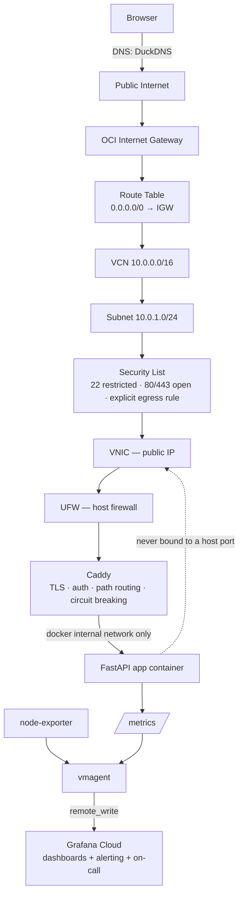
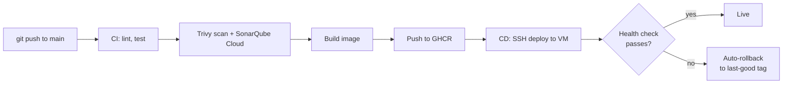

# Solo-SRE

**The full production lifecycle — CI/CD, service-mesh-equivalent networking, observability, incident response — built on a single free-tier VM instead of a cluster, on purpose.**

---

## The problem this solves

Most portfolio projects show one skill in isolation: a Dockerfile, a Terraform script, a dashboard screenshot. Harder to fake — and what this project is built to show — is understanding *why* an organization reaches for Kubernetes, a service mesh, and a self-hosted observability stack at scale, and being able to deliver the same operational guarantees without them when the scale doesn't justify the cost.

Real incidents happened while building this — a crash-looping reverse proxy, a race condition during VM bootstrap, a DNS misconfiguration, a multi-layered networking bug that took several wrong turns to actually solve. Those are documented as they happened, not cleaned up after the fact — see [Real incidents](#real-incidents-encountered-while-building-this) below and the full write-ups in [`docs/runbook.md`](docs/runbook.md).

## Skills demonstrated

| Discipline | Implementation |
|---|---|
| Infrastructure as Code | Terraform — VCN, subnet, security list, internet gateway, route table, instance, all version-controlled and plan-gated behind a manual approval in CI |
| Configuration management | Ansible — VM bootstrap: Docker install, UFW rules, swap configuration, unattended security upgrades |
| CI/CD | GitHub Actions — lint, test, Trivy scan, SonarQube Cloud scan, build, push to GHCR, SSH deploy, health-check-gated automatic rollback |
| Security | Defense in depth: OCI Security List (with an explicit egress rule, since OCI has no default-allow-outbound) → UFW → Caddy (TLS, path routing, basic auth, passive-health-check circuit breaking) → app never bound to a host port |
| Observability | RED metrics (app) + USE metrics (host), shipped via `vmagent` to Grafana Cloud's free tier, dashboarded and alerted on |
| SLOs & incident response | Defined SLIs/SLOs at 99.0% (not an aspirational number — what a single-VM, single-AZ system can actually promise), burn-rate alerting through Grafana IRM with a tested on-call escalation, a runbook, and chaos scripts that exercise real failure modes |

## Architecture

## What large orgs run, and what stands in for it here

| At organization scale | In this project | Why the swap holds up |
|---|---|---|
| Kubernetes (EKS/GKE) | Docker Compose on one OCI e2.micro | Orchestration exists to schedule across many nodes and reschedule on failure — on one node it's overhead with no payoff |
| ArgoCD / Flux | GitHub Actions CD — SSH deploy, health-check gate, automatic rollback | Same principle (git as source of truth, automated and reversible deploys), sized for one target instead of a cluster |
| Istio / service mesh | Caddy — TLS, path routing, auth, passive circuit breaking, weighted canary support | A mesh manages sidecar-to-sidecar traffic across many services; with one service, Caddy gives the same edge capabilities without the sidecar tax |
| Self-hosted Prometheus + Grafana HA pair | `vmagent` + Grafana Cloud free tier | Same RED/USE model; storage, dashboards, and alerting run off-box entirely |
| PagerDuty / Opsgenie | Grafana IRM (on-call schedule + escalation chain) | Same alert-to-human pattern, tested end-to-end by deliberately tripping an alert, not just configured |
| Vault / Secrets Manager | GitHub Actions secrets + `.env` on the VM (OIDC-based short-lived Terraform auth on the roadmap) | Same core principle — no long-lived credentials sitting around — at a scale that doesn't need a dedicated secrets cluster |
| Self-hosted SonarQube + Trivy Operator | SonarQube Cloud (free tier) + Trivy in CI | Same quality/security gates, running on GitHub's infrastructure instead of a dedicated scanning cluster |

## What's actually being observed, and how

**RED (application)** — instrumented in `app/main.py` via `prometheus_client`:
- `http_requests_total{path, status}` → request rate and error rate per endpoint
- `http_request_duration_seconds{path}` → a histogram, giving p50/p95/p99 via `histogram_quantile()`, not just an average

**USE (host)** — `node-exporter`, scraped locally by `vmagent` on the same Docker network (no host-networking or firewall exceptions needed — see the incident writeup below for why that specific design was chosen):
- CPU utilization and saturation
- Memory + swap utilization — the one that matters most on 1GB RAM
- Disk utilization

Both are scraped every 30s and shipped via `remote_write` to Grafana Cloud — no metrics storage runs on the VM itself. Dashboard definition: [`dashboards/solo-sre-dashboard.json`](dashboards/solo-sre-dashboard.json).

**Alerting → on-call**: burn-rate alerts (defined in [`docs/slo.md`](docs/slo.md)) route through Grafana IRM to a real on-call schedule and escalation chain, verified by deliberately tripping `/error` and confirming the notification actually arrived — not just configured and left unverified.

## Chaos engineering — `scripts/chaos-test.sh`

| Scenario | Simulates | Expected recovery |
|---|---|---|
| `kill-app` | Process crash | Docker restarts the container automatically (`restart: unless-stopped`) |
| `cpu-spike` | Traffic spike on burstable CPU | Latency degrades visibly on the dashboard rather than the instance falling over |
| `fill-disk` | Disk exhaustion | Surfaces the failure mode deliberately, before it happens for real |
| `oom` | Memory limit breach | Container OOM-killed and restarted — proves the `mem_limit` + restart policy combination actually works |

Each run gets written up in [`docs/postmortem-template.md`](docs/postmortem-template.md) — a filled-in postmortem from a real, self-induced incident, dashboard screenshots included, is stronger evidence than a description of "SRE principles."

## Real incidents encountered while building this

Kept here deliberately, because working through them *is* the point of the project. Full diagnostic detail in [`docs/runbook.md`](docs/runbook.md).

- **Caddy crash-looped on first deploy.** `rate_limit is not a registered directive` — the Caddyfile referenced a plugin that only exists in a custom-built image, not the stock one actually running. Root-caused via `docker logs caddy`, fixed by disabling the plugin-dependent config until the custom build is in use.
- **`apt update` failed intermittently during Ansible bootstrap.** Traced to `cloud-init` still holding the apt lock on a fresh VM. Fixed by adding an explicit `cloud-init status --wait` task before any `apt` task, instead of just retrying blindly into the race.
- **DNS pointed at the wrong IP.** DuckDNS auto-filled the browser's own IP at signup, not the VM's. Caught via `curl -v` returning a connection *timeout* rather than a TLS error — a useful signal the problem was network reachability, not certificate configuration.
- **Metrics pipeline had three separate root causes stacked on top of each other.** `vmagent` and `node-exporter` were on different Docker network types (host networking vs. a bridge network) and couldn't reach each other by name. Working around it with a raw IP address then hit Docker's own bridge-to-bridge isolation, then an unopened firewall port. The actual fix wasn't another workaround — it was recognizing `node-exporter` never needed host networking at all (`pid: host` + a mounted host filesystem already gives it real host metrics), and moving it onto the same bridge network as everything else, which removed the whole class of problem instead of patching around each symptom of it.

## How to verify it yourself

1. `https://<domain>/health` → `{"status":"healthy"}`
2. `docker logs caddy` shows successful ACME certificate issuance
3. `curl -u monitor:*** https://<domain>/metrics` returns live Prometheus metrics
4. Grafana Explore shows real `http_requests_total` data
5. The imported dashboard shows populated RED + USE panels
6. GitHub Actions shows green CI and CD runs
7. SonarQube Cloud shows a scanned project
8. A chaos scenario run shows a visible dip and recovery on the dashboard

Screenshots of each: [`SCREENSHOTS.md`](SCREENSHOTS.md).

## Full setup instructions
[`docs/setup.md`](docs/setup.md) — secrets, Grafana Cloud credential walkthrough, Ansible bootstrap, first deploy.

## Roadmap
- Short-lived SSH certificates instead of a static deploy key
- OCI Workload Identity Federation to remove the static OCI API key from CI
- A second app instance behind Caddy for a real weighted canary rollout

---

*Everything in this repo runs at $0/month. [`docs/architecture.md`](docs/architecture.md) has the full networking + TLS walkthrough, [`docs/slo.md`](docs/slo.md) the SLIs/SLOs and PromQL, [`docs/runbook.md`](docs/runbook.md) the incident-response playbook.*
