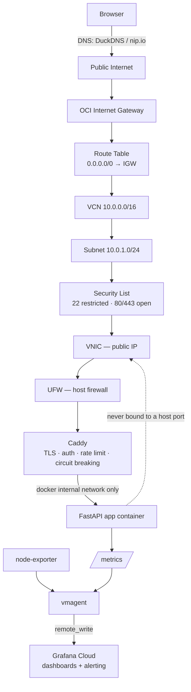
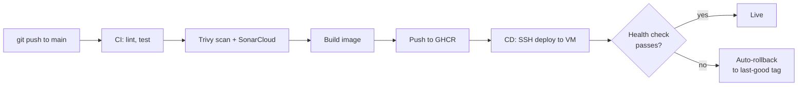

# Solo-SRE

**A single free-tier VM, run the way a production system is run — not the way a tutorial is run.**

---

## The need

I wanted a project that couldn't be faked with a tutorial: something that forces the same tradeoffs a real on-call engineer makes — capacity planning, defense in depth, deciding what has to run where, and having a rollback plan *before* you need one — and that's honest about its own limits instead of hiding them.

## The constraint, on purpose

Everything here runs on a single Oracle Cloud **Always Free** e2.micro instance — 1 vCPU (burstable), 1GB RAM, $0/month. I didn't pick this because it's impressive hardware. I picked it because it removes the option of solving problems by throwing resources at them. Every decision below exists *because* of that constraint, and that reasoning is the actual point of the project.

## What it demonstrates

| Area | What's built |
|---|---|
| **Infrastructure as Code** | Terraform provisions the full OCI network (VCN, subnet, security list, internet gateway, route table) and the instance itself |
| **Configuration management** | Ansible bootstraps the VM — Docker, firewall rules, swap, unattended security upgrades |
| **CI/CD** | GitHub Actions: lint → test → Trivy dependency/image scan → SonarCloud static analysis → build → push to GHCR → SSH deploy → automated health-check-gated rollback |
| **Observability** | RED metrics (rate/errors/duration) on the app, USE metrics (utilization/saturation/errors) on the host, shipped to a free hosted backend since self-hosting Prometheus+Grafana would exceed the memory budget |
| **Networking & security** | Defense in depth: cloud firewall (OCI Security List) → host firewall (UFW) → reverse proxy (Caddy: automatic TLS, path-based routing, rate limiting, passive-health-check circuit breaking, basic auth on internal endpoints) → the app itself is never exposed on a host port |
| **SLOs & incident response** | Defined SLIs/SLOs, an error-budget burn-rate alert, a runbook for the failure modes I actually tested, and a blameless postmortem written from a real (self-induced) incident |

## Architecture

## Why this approach, specifically

- **No load balancer, one public IP, and I say so.** A single VM is a single point of failure. Rather than dress that up, the docs name it directly — that honesty is more useful to a reviewer than pretending this is production-grade HA.
- **Nothing heavy runs on the VM.** CI, security scanning, and metrics storage/dashboards all run off-box (GitHub Actions, GHCR, Grafana Cloud free tier) for free. The VM only carries what absolutely must be on it: the app, the proxy, and a lightweight metrics shipper. Knowing what has to run where, under a real resource ceiling, is the actual skill this project is built to show.
- **The SLO is 99.0%, not 99.9%.** Claiming five-nines on hardware that can't deliver it would be dishonest. The number reflects what a single-VM, single-AZ system can actually promise.
- **Immutable, versioned deploys.** Every image is tagged by git SHA, never `latest` in practice — so rollback is "redeploy a known-good artifact," decided in advance, not improvised during an incident.

## How to run it

Full setup instructions — including exact GitHub secret names, the Grafana Cloud API key walkthrough, and the Ansible bootstrap flow — are in [`docs/setup.md`](docs/setup.md).

1. `terraform apply` — provisions the VCN, subnet, security list, and VM
2. Run the **Ansible Bootstrap** GitHub Actions workflow — installs Docker, UFW, swap
3. SSH in once to set `.env` (GHCR + Grafana Cloud credentials)
4. First manual `docker compose up -d`
5. From then on, every push to `main` deploys itself — CI builds and scans, CD ships it, a failed health check rolls it back automatically

## What's next
- Short-lived SSH certificates instead of a static deploy key
- OCI Workload Identity Federation to remove the static OCI API key from CI entirely
- A second app instance behind Caddy for a real weighted canary rollout

---

*Everything in this repo runs at $0/month. See [`docs/architecture.md`](docs/architecture.md) for the full networking and TLS walkthrough, [`docs/slo.md`](docs/slo.md) for the SLIs/SLOs and PromQL, and [`docs/runbook.md`](docs/runbook.md) for the incident-response playbook.*
