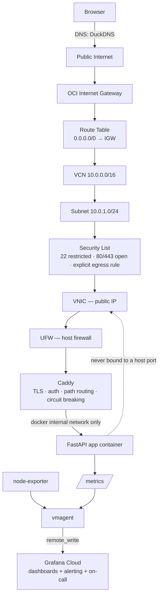
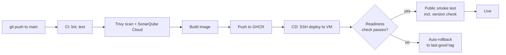

# Solo-SRE

**The full production lifecycle — CI/CD, service-mesh-equivalent networking, observability, incident response — built on a single free-tier VM instead of a cluster, on purpose.**

---

## The problem this solves

Most portfolio projects show one skill in isolation: a Dockerfile, a Terraform script, a dashboard screenshot. Harder to fake — and what this project is built to show — is understanding *why* an organization reaches for Kubernetes, a service mesh, and a self-hosted observability stack at scale, and being able to deliver the same operational guarantees without them when the scale doesn't justify the cost.

The workload is **Devkit**, a small stateless utility API (hashing, encoding, JWT decoding, token generation). It is deliberately simple: it exists to be a real, running service that the platform around it can deploy, observe, break, and recover. The tracing, metrics, probes and deploy pipeline are intentionally heavier than a hash endpoint needs, because that surrounding platform is the subject of the project.

Real incidents happened while building this — a crash-looping reverse proxy, a race condition during VM bootstrap, a DNS misconfiguration, a multi-layered networking bug that took several wrong turns to actually solve. Those are documented as they happened, not cleaned up after the fact — see [Real incidents](#real-incidents-encountered-while-building-this) below and the full write-ups in [`docs/runbook.md`](docs/runbook.md).

## Skills demonstrated

| Discipline | Implementation |
|---|---|
| Infrastructure as Code | Terraform — VCN, subnet, security list, internet gateway, route table, instance, all version-controlled and plan-gated behind a manual approval in CI |
| Configuration management | Ansible — VM bootstrap: Docker install, UFW rules, swap configuration, unattended security upgrades |
| CI/CD | GitHub Actions — lint, test, Trivy scan, SonarQube Cloud scan, build, push to GHCR, SSH deploy, readiness-gated automatic rollback, external post-deploy smoke test that verifies the deployed commit is the one serving traffic |
| Security | Defense in depth: OCI Security List (with an explicit egress rule, since OCI has no default-allow-outbound) → UFW → Caddy (TLS, path routing, basic auth, passive-health-check circuit breaking) → app never bound to a host port. In the app: per-IP rate limiting, and `X-Forwarded-For` is only trusted for a configured number of proxy hops, so clients can't spoof their address |
| Observability | RED metrics (app) + USE metrics (host), shipped via `vmagent` to Grafana Cloud's free tier, dashboarded and alerted on; distributed traces via OpenTelemetry |
| SLOs & incident response | Defined SLIs/SLOs at 99.0% (not an aspirational number — what a single-VM, single-AZ system can actually promise), burn-rate alerting through Grafana IRM with a tested on-call escalation, a runbook, and chaos scripts that exercise real failure modes |

## Architecture





## What large orgs run, and what stands in for it here

| At organization scale | In this project | Why the swap holds up |
|---|---|---|
| Kubernetes (EKS/GKE) | Docker Compose on one OCI e2.micro | Orchestration exists to schedule across many nodes and reschedule on failure — on one node it's overhead with no payoff |
| ArgoCD / Flux | GitHub Actions CD — SSH deploy, readiness gate, automatic rollback | Same principle (git as source of truth, automated and reversible deploys), sized for one target instead of a cluster |
| Istio / service mesh | Caddy — TLS, path routing, auth, passive circuit breaking, weighted canary support | A mesh manages sidecar-to-sidecar traffic across many services; with one service, Caddy gives the same edge capabilities without the sidecar tax |
| Self-hosted Prometheus + Grafana HA pair | `vmagent` + Grafana Cloud free tier | Same RED/USE model; storage, dashboards, and alerting run off-box entirely |
| PagerDuty / Opsgenie | Grafana IRM (on-call schedule + escalation chain) | Same alert-to-human pattern, tested end-to-end by deliberately tripping an alert, not just configured |
| Vault / Secrets Manager | GitHub Actions secrets + `.env` on the VM (OIDC-based short-lived Terraform auth on the roadmap) | Same core principle — no long-lived credentials sitting around — at a scale that doesn't need a dedicated secrets cluster |
| Self-hosted SonarQube + Trivy Operator | SonarQube Cloud (free tier) + Trivy in CI | Same quality/security gates, running on GitHub's infrastructure instead of a dedicated scanning cluster |

## The application: Devkit

A single-file FastAPI service (`app/main.py`), configured entirely through environment variables so the same image runs in every environment.

**Endpoints**

| Endpoint | Purpose |
|---|---|
| `GET /healthz` | Liveness — the process is up. Never checks dependencies |
| `GET /readyz` | Readiness — safe to receive traffic; used by the deploy gate. Checks the upstream only if `UPSTREAM_REQUIRED=true` |
| `GET /status` | Version (the deployed git SHA) and uptime |
| `GET /metrics` | Prometheus metrics (basic-auth protected at the edge) |
| `GET /api/uuid`, `/api/time`, `/api/ip` | UUID v4, epoch + ISO time, caller IP |
| `GET /api/hash`, `/api/base64`, `/api/url` | Hash, Base64, and URL encode/decode |
| `POST /api/json` | Validate and pretty-print JSON |
| `POST /api/jwt/decode` | Decode a JWT header and payload. **Does not verify the signature**; the response says so. POST-only so tokens don't land in access logs |
| `GET /api/token` | Cryptographically random token (`secrets`), as urlsafe, hex, or password |
| `GET /greet` | Calls a downstream service; exists only when `UPSTREAM_URL` is set |
| `GET /_chaos/slow`, `/_chaos/error` | Fault injection; exist only when `CHAOS_ENABLED=true`, and are not routed publicly |

**Configuration**

| Variable | Default | Effect |
|---|---|---|
| `APP_VERSION` | `dev` | Reported by `/status`; set to the image tag at deploy time |
| `RATE_LIMIT_PER_MIN` | `60` | Per-IP limit on `/api/*` (`0` disables). In-memory, so per replica; a global limit belongs at the edge or in a shared store |
| `TRUSTED_PROXY_HOPS` | `0` | Number of trusted proxies in front of the app. `0` ignores `X-Forwarded-For` entirely; behind Caddy it is `1` |
| `OTEL_EXPORTER_OTLP_ENDPOINT` | unset | Enables tracing. If unset, the app runs without it; tracing setup failures never stop startup |
| `UPSTREAM_URL` / `UPSTREAM_REQUIRED` | unset / `false` | Optional downstream dependency for `/greet`, and whether readiness depends on it |
| `CHAOS_ENABLED` | `false` | Exposes `/_chaos/*` |

## What's actually being observed, and how

**RED (application)** — instrumented in `app/main.py` via `prometheus_client`:
- `http_requests_total{method, path, status}` → request rate and error rate per endpoint
- `http_request_duration_seconds{method, path}` → a histogram, giving p50/p95/p99 via `histogram_quantile()`, not just an average

The `path` label is the route template rather than the raw URL, so label cardinality stays bounded no matter what clients request; unknown paths collapse into `unmatched`. Probe and metrics endpoints are excluded so they don't dilute the SLI. Requests rejected by the rate limiter are counted too (as 429s).

**USE (host)** — `node-exporter`, scraped locally by `vmagent` on the same Docker network (no host-networking or firewall exceptions needed — see the incident writeup below for why that specific design was chosen):
- CPU utilization and saturation
- Memory + swap utilization — the one that matters most on 1GB RAM
- Disk utilization

Both are scraped every 30s and shipped via `remote_write` to Grafana Cloud — no metrics storage runs on the VM itself. Dashboard definition: [`dashboards/solo-sre-dashboard.json`](dashboards/solo-sre-dashboard.json).

**Traces** — `app` calls `greeting-service` over HTTP at `/greet`, both instrumented with OpenTelemetry (`opentelemetry-instrumentation-fastapi` on each service, `opentelemetry-instrumentation-httpx` on the caller). Trace context propagates automatically across that call, so Tempo shows it as **one connected trace with two spans**, not two unrelated ones — that's what makes it real distributed tracing rather than isolated request logging: you can see exactly how much of `/greet`'s total latency happened in `app` versus inside `greeting-service`. Ships via OTLP/HTTP straight from the Python process to Grafana Cloud Tempo, same off-box pattern as metrics and logs. Health, readiness and metrics requests are excluded from tracing.

**Alerting → on-call**: burn-rate alerts (defined in [`docs/slo.md`](docs/slo.md)) route through Grafana IRM to a real on-call schedule and escalation chain, verified by deliberately tripping the chaos error endpoint and confirming the notification actually arrived — not just configured and left unverified.

## Chaos engineering — `scripts/chaos-test.sh`

| Scenario | Simulates | Expected recovery |
|---|---|---|
| `kill-app` | Process crash | Docker restarts the container automatically (`restart: unless-stopped`) |
| `cpu-spike` | Traffic spike on burstable CPU | Latency degrades visibly on the dashboard rather than the instance falling over |
| `fill-disk` | Disk exhaustion | Surfaces the failure mode deliberately, before it happens for real |
| `oom` | Memory limit breach | Container OOM-killed and restarted — proves the `mem_limit` + restart policy combination actually works |

The app also has opt-in fault endpoints (`/_chaos/slow` for latency, `/_chaos/error` for a ~30% error rate) used to exercise the SLO and burn-rate alerts. They are off by default and are never exposed on the public listener — they are only reachable from the internal Docker network. Infrastructure-level faults belong at the proxy or mesh layer, which is where they would live in a cluster.

Each run gets written up in [`docs/postmortem-template.md`](docs/postmortem-template.md) — a filled-in postmortem from a real, self-induced incident, dashboard screenshots included, is stronger evidence than a description of "SRE principles."

## Real incidents encountered while building this

Kept here deliberately, because working through them *is* the point of the project. Full diagnostic detail in [`docs/runbook.md`](docs/runbook.md).

- **Caddy crash-looped on first deploy.** `rate_limit is not a registered directive` — the Caddyfile referenced a plugin that only exists in a custom-built image, not the stock one actually running. Root-caused via `docker logs caddy`, fixed by disabling the plugin-dependent config until the custom build is in use.
- **`apt update` failed intermittently during Ansible bootstrap.** Traced to `cloud-init` still holding the apt lock on a fresh VM. Fixed by adding an explicit `cloud-init status --wait` task before any `apt` task, instead of just retrying blindly into the race.
- **DNS pointed at the wrong IP.** DuckDNS auto-filled the browser's own IP at signup, not the VM's. Caught via `curl -v` returning a connection *timeout* rather than a TLS error — a useful signal the problem was network reachability, not certificate configuration.
- **Metrics pipeline had three separate root causes stacked on top of each other.** `vmagent` and `node-exporter` were on different Docker network types (host networking vs. a bridge network) and couldn't reach each other by name. Working around it with a raw IP address then hit Docker's own bridge-to-bridge isolation, then an unopened firewall port. The actual fix wasn't another workaround — it was recognizing `node-exporter` never needed host networking at all (`pid: host` + a mounted host filesystem already gives it real host metrics), and moving it onto the same bridge network as everything else, which removed the whole class of problem instead of patching around each symptom of it.
- **The post-deploy smoke test failed on a "successful" deploy.** Readiness passed, but the smoke test compared the SHA reported by `/status` with the SHA just deployed and saw `dev`: the new code was running, but the version was never passed into the containers. A readiness check alone would have called that a success. This is the reason the smoke test verifies *what* is serving traffic, not just *that* something is.

## Deployment strategies — what's real, what's roadmap

Every image is tagged by git SHA when it's built (`ci.yml` pushes both `:latest` and `:<sha>`), and `cd.yml` deploys the specific SHA — the commit CI actually tested, not whatever `main` has moved to since — never floating `:latest`. That distinction is what makes rollback deterministic instead of a guess. Deploys are serialized with a concurrency group so two can never overlap.

**Rollback (built, tested for real):** Before every deploy, the currently-running tag is saved to `.last_good_tag`. After deploying the new tag, a readiness check runs (through Caddy, with retries) — if it fails, the pipeline immediately redeploys the saved tag automatically, no human involved. This has already happened for real during development (see [Real incidents](#real-incidents-encountered-while-building-this)) — it's not just configured, it's been proven to fire correctly under a genuine failure.

**Rolling deployment (built):** what `cd.yml` actually does today — pull the new tag, recreate the `app` container, gate on readiness. On a single instance this is precisely "recreate with a safety net," not a multi-node rolling update — worth being exact about that distinction rather than overclaiming it.

**Blue-green (designed, not built):** would mean running two `app` containers simultaneously — start the new one alongside the old one, health-check the new one, atomically flip Caddy's `reverse_proxy` upstream to it, then stop the old one. This removes even the brief gap the current rolling recreate has. Not built because it needs sustained extra memory for the overlap window, which is the actual tradeoff on a 1GB instance — not a knowledge gap.

**Canary (designed, not built):** Caddy's `reverse_proxy` supports `lb_policy weighted 9 1` across two upstreams — the mechanism exists and is documented inline in `caddy/Caddyfile`. Needs a real second `app-canary` service running a second image tag before it does anything; currently commented out as a syntax reference, not a live toggle.

## Authentication & authorization at the edge (Caddy)

**Authentication — yes, real:** `/metrics` is protected by HTTP Basic Auth (`basic_auth` directive), credentials stored as a bcrypt hash, never plaintext, in `Caddyfile`.

**Authorization — partial, and worth being precise about the boundary:** Caddy enforces *path-based* access control — who can reach `/metrics` at all, via `handle_path`. That's coarse authorization (a gate), not fine-grained authorization (per-user permissions, roles, scopes) — which belongs in the application layer, not the reverse proxy. This project doesn't currently need per-user auth since there's no multi-user concept in the app itself; if it grew one, that logic would live in FastAPI (e.g. JWT validation), with Caddy still handling the coarse edge gate in front of it.

## Post-deploy verification — smoke testing after CD

Built. After the deploy job's readiness gate passes, a second job runs **from the GitHub Actions runner, outside the VM**, against the real public URL — so DNS, TLS, Caddy and the app are all exercised the way a real user reaches them:

```yaml
  smoke-test:
    needs: deploy
    runs-on: ubuntu-latest
    steps:
      - name: Verify the live public endpoint post-deploy
        run: |
          set -e
          curl -fsS --retry 3 --retry-delay 2 "$BASE_URL/readyz"
          curl -fsS "$BASE_URL/" | grep -q "Devkit"
          curl -fsS "$BASE_URL/api/hash?text=smoke&algo=sha256" | grep -q '"hash"'
          LIVE=$(curl -fsS "$BASE_URL/status" | jq -r .version)
          [ "$LIVE" = "$NEW_TAG" ] || { echo "live=$LIVE expected=$NEW_TAG"; exit 1; }
```

The last check is the important one: it asserts that the commit serving traffic is the commit that was just deployed, so a "successful" pipeline can't be produced by the old containers still answering. It also exercises a real tool endpoint instead of a fault-injection route, which should never be a production dependency.

## Roadmap

- Short-lived SSH certificates instead of a static deploy key
- OCI Workload Identity Federation to remove the static OCI API key from CI
- A second app instance behind Caddy for a real weighted canary rollout
- Run the `pytest` suite against the live URL as part of the smoke stage

---
## 🔗 Useful Links

Explore the live application, observability dashboards, and code-quality reports:

| Resource                 | Link                                                                                                                       | Purpose                                                                |
| ------------------------ | -------------------------------------------------------------------------------------------------------------------------- | ---------------------------------------------------------------------- |
| 🚀 **Live Application**  | [Solo-SRE](https://solo-sre-pg.duckdns.org/)                                                                               | Access the live application and SRE demo                               |
| 📊 **Grafana Dashboard** | [Solo-SRE Grafana](https://merrycanary2243.grafana.net/d/vak4trs/solo-sre?from=now-1h&to=now&timezone=browser&refresh=30s) | Monitor application metrics, traffic, latency, errors, and SRE signals |
| 🔍 **SonarCloud**        | [SonarCloud Projects](https://sonarcloud.io/organizations/e-vanika/projects)                                               | Code quality, security analysis, and maintainability insights          |

### 🩺 Live Service Endpoints

* **Readiness:** `https://solo-sre-pg.duckdns.org/readyz`
* **Status / deployed version:** `https://solo-sre-pg.duckdns.org/status`
* **API docs:** `https://solo-sre-pg.duckdns.org/docs`
* **Metrics:** `https://solo-sre-pg.duckdns.org/metrics` (basic auth)

> 💡 Fault injection (`/_chaos/*`) is disabled on the public listener. Latency and error scenarios for demonstrating **observability, alerting, error budgets, burn-rate analysis, and incident response** are driven from inside the Docker network, using the chaos scripts.

### ⚙️ Deployment

The application is deployed using **GitHub Actions CI/CD** with:

* 🔄 Automated deployments, serialized so they never overlap
* 🏷️ Git SHA-based image tagging, using the exact commit CI tested
* ❤️ Readiness-gated releases
* ↩️ Automatic rollback on failed deployments
* ✅ External smoke test that verifies the deployed version is the one serving traffic
* 🔐 TLS-enabled access
* 📈 Production-style observability

---
*Everything in this repo runs at $0/month. [`docs/architecture.md`](docs/architecture.md) has the full networking + TLS walkthrough, [`docs/slo.md`](docs/slo.md) the SLIs/SLOs and PromQL, [`docs/runbook.md`](docs/runbook.md) the incident-response playbook.*