# 📊 Production Monitoring & Observability

## Security & Infrastructure

### TLS Certificate Automation
Automatic TLS certificate provisioning and renewal via Caddy—demonstrating zero-touch security infrastructure and automated certificate lifecycle management.

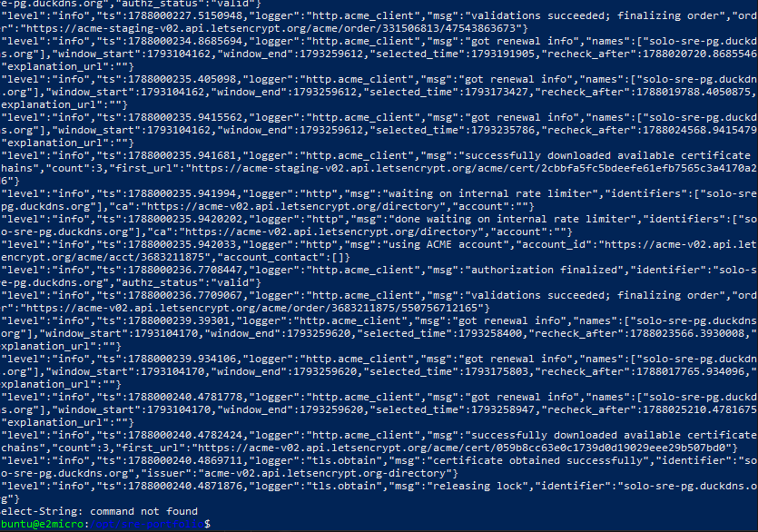

---

## Metrics Collection & Aggregation

### VictoriaMetrics Rte Writemoe
Lightweight metrics aggregation and remote storage, optimized for resource-constrained environments. Metrics are scraped from Prometheus exporters and shipped to Grafana Cloud for centralized observability without overloading the 1GB VM.

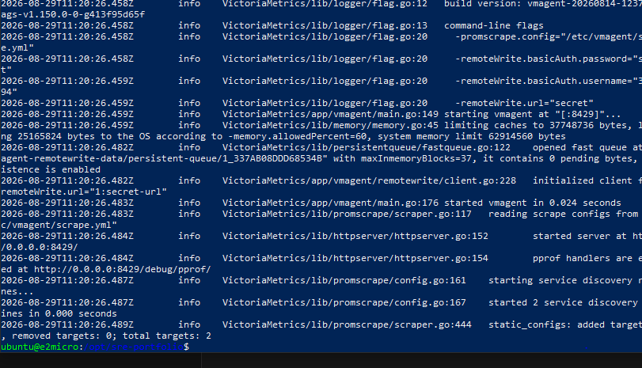

---

## Grafana Dashboards: RED & USE Metrics

All dashboards display application and host metrics scraped from Prometheus exporters in real-time.

### Request Rate by Path (RED Metric)
Application throughput visualization—tracking requests per second by endpoint. Essential for detecting traffic anomalies and understanding application load patterns.

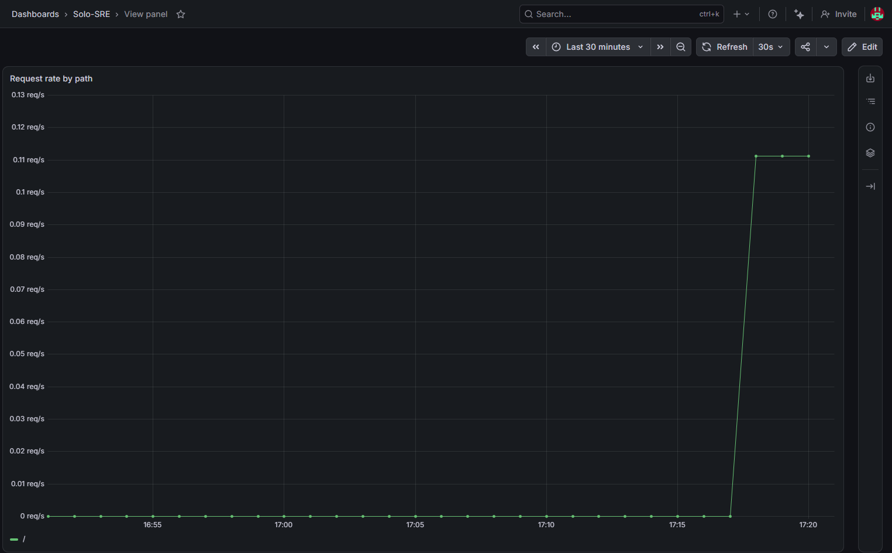

### P95 Latency (RED Metric)
Tail latency tracking to detect performance degradation. The 95th percentile captures real user experience without being skewed by outliers.

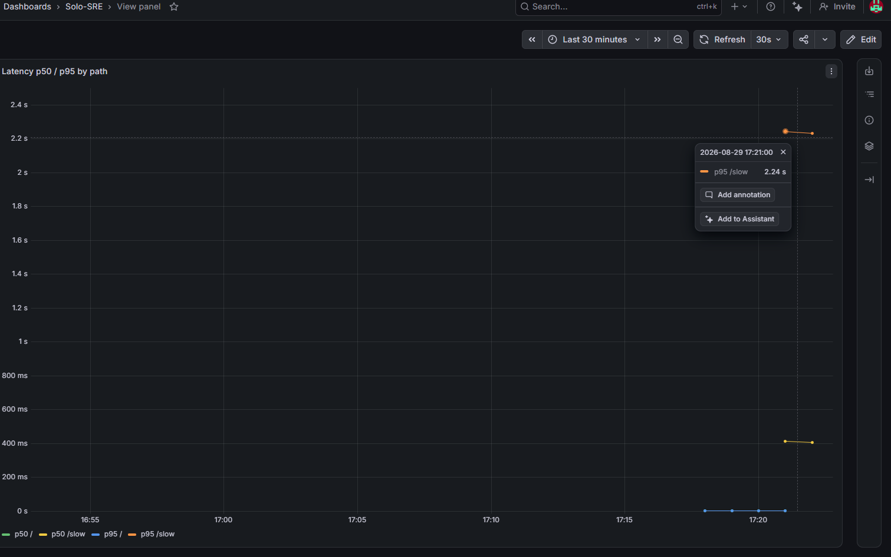

### CPU Utilization (USE Metric)
Host CPU consumption across container workloads. Demonstrates resource saturation detection and capacity planning under the 1-vCPU constraint.

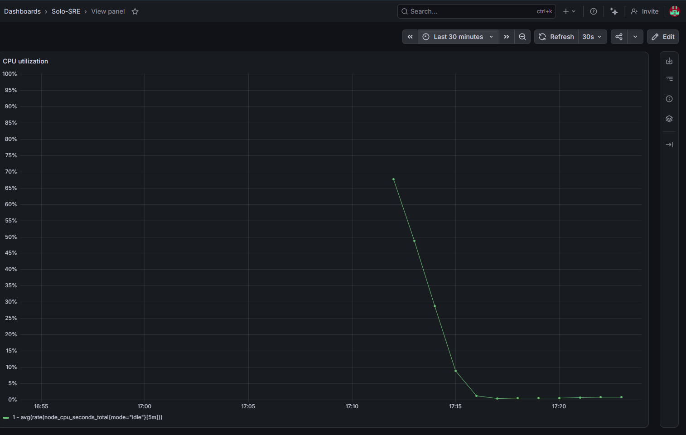

### Memory and Swap Utilization (USE Metric)
RAM pressure monitoring on the 1GB instance—critical for detecting memory leaks, OOM conditions, and swap thrashing. Proves the system can run production workloads on minimal resources.

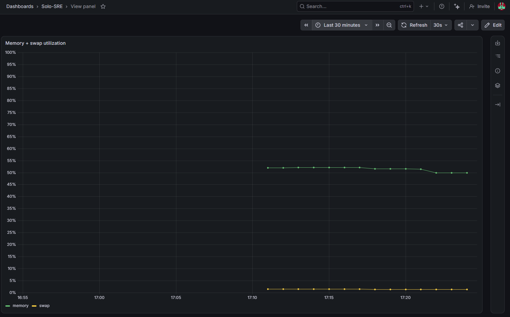

### Container Restart Monitoring
Tracks pod/container churn—a leading indicator of instability, resource starvation, or application crashes. Healthy systems show stable restart counts.

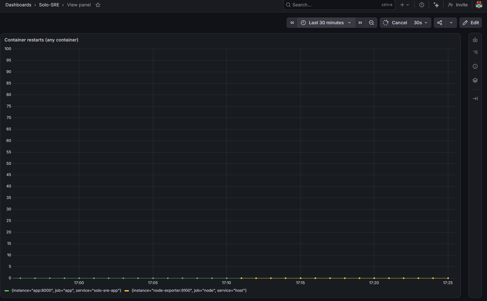

### Disk I/O and Utilization (USE Metric)
Disk consumption and I/O patterns. Monitors for storage saturation and identifies workloads with heavy disk activity.

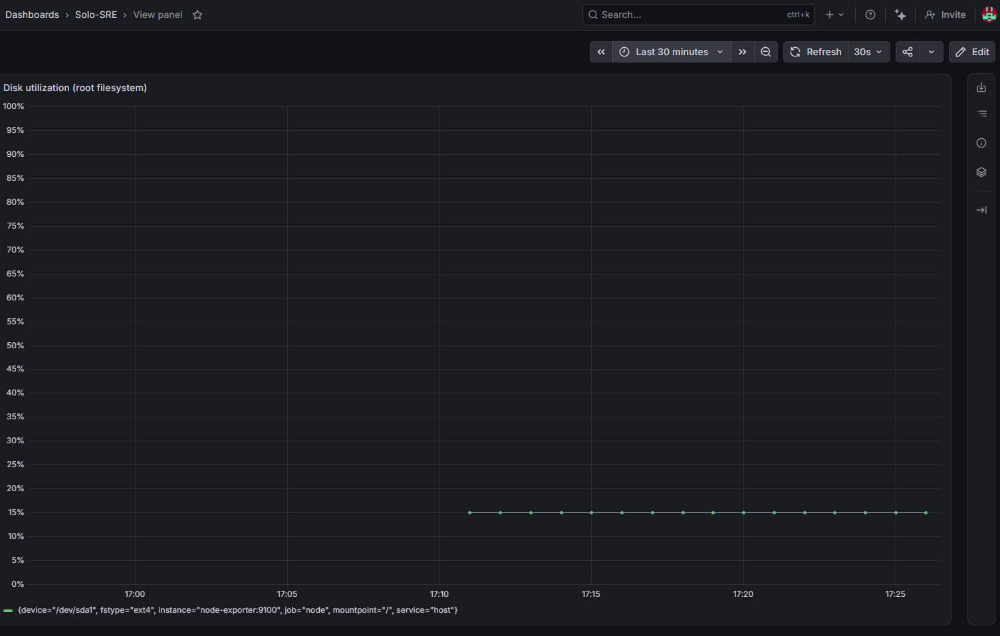

chaos enginerr

killed th app 
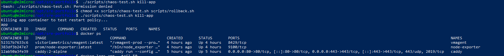

brought back it 

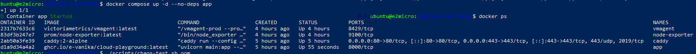

oom pod came automatically 

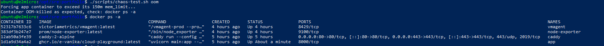

Grafana dashbaords during the process :
.

Grafana dahboard through out the process:

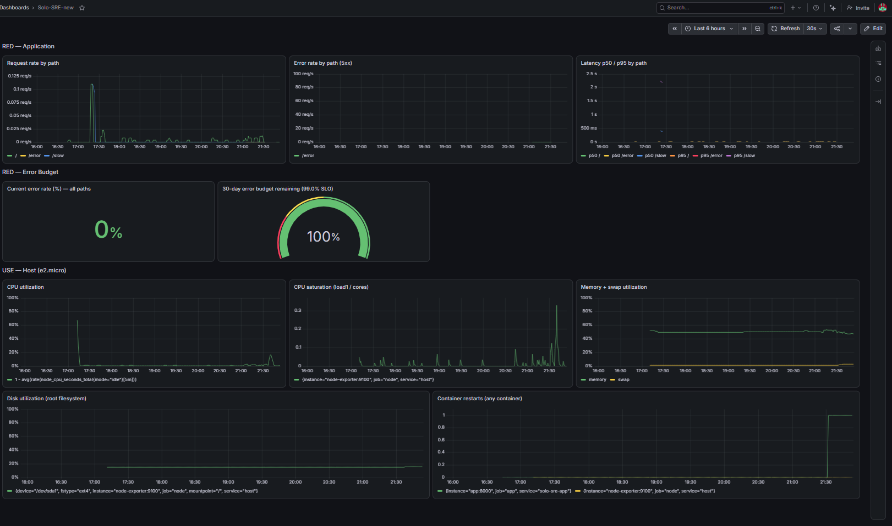

