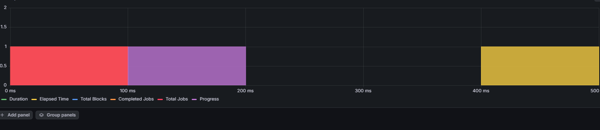
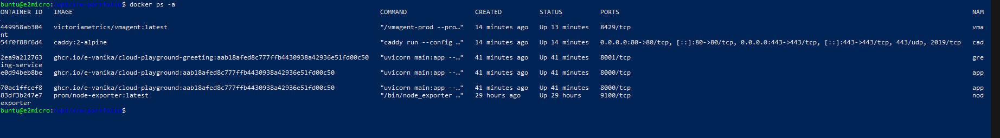
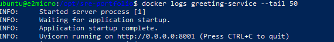
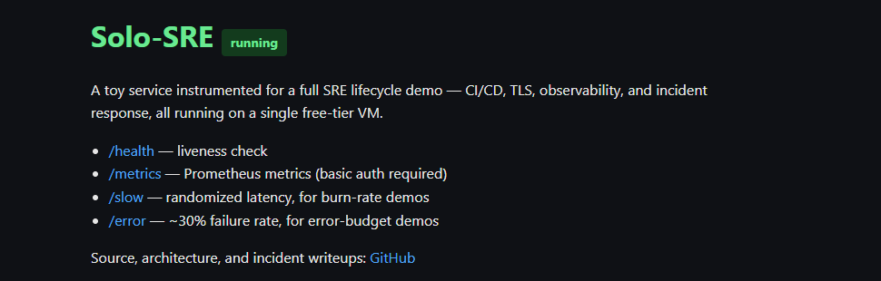

# 📊 Production Monitoring & Observability

## Security & Infrastructure

### TLS Certificate Automation
Implemented automatic TLS certificate provisioning and renewal using Caddy reverse proxy—demonstrating zero-touch security infrastructure and fully automated certificate lifecycle management. Eliminates manual certificate renewals and reduces security vulnerabilities through continuous automated compliance.

---

## Metrics Collection & Aggregation

### VictoriaMetrics Remote Write Mode
Engineered lightweight metrics aggregation and remote storage solution, optimized for resource-constrained environments. Leverages Prometheus exporters to scrape detailed system and application metrics, with remote write capabilities to Grafana Cloud for centralized observability and analytics. Designed to maintain high fidelity monitoring without overloading the 1GB VM, ensuring optimal resource utilization in production environments.

---

## Grafana Dashboards: RED & USE Metrics

Built comprehensive observability dashboards using RED (Request, Error, Duration) and USE (Utilization, Saturation, Errors) methodologies to display real-time application and host metrics. These industry-standard frameworks enable rapid diagnosis of performance bottlenecks and system health issues.

### Request Rate by Path (RED Metric)
Developed real-time application throughput visualization tracking requests per second by endpoint. Enables rapid detection of traffic anomalies, unusual load patterns, and performance degradation across service endpoints. Critical metric for understanding user experience and capacity planning.

### P95 Latency (RED Metric)
Implemented tail latency monitoring using 95th percentile analysis to accurately capture real user experience without being skewed by outliers. Detects subtle performance degradation early before it impacts user satisfaction and SLA compliance.

### CPU Utilization (USE Metric)
Monitor host CPU consumption across containerized workloads to detect resource saturation and prevent performance throttling. Validates efficient capacity planning and workload optimization under the 1-vCPU constraint, proving ability to run production-grade services on minimal infrastructure.

### Memory and Swap Utilization (USE Metric)
Critical RAM pressure monitoring on the memory-constrained 1GB instance for detecting memory leaks, OOM (Out-of-Memory) conditions, and swap thrashing. Demonstrates advanced resource management and container orchestration capabilities, proving the system reliably runs production workloads on minimal resources while maintaining stability and performance.

### Container Restart Monitoring
Developed intelligent pod/container restart tracking to measure system stability. Container churn serves as a leading indicator of instability, resource starvation, or application crashes. Enables proactive incident detection and helps maintain SLA compliance through early warning signals.

### Disk I/O and Utilization (USE Metric)
Comprehensive disk consumption and I/O pattern analysis to identify storage saturation and workloads with heavy disk activity. Enables proactive capacity planning and workload optimization to prevent disk-related performance bottlenecks.

## Chaos Engineering & Resilience Testing

Conducted comprehensive chaos engineering tests to validate system resilience and automatic recovery capabilities in production-like scenarios.

### Application Failure & Recovery
Simulated critical application failure by terminating the service pod. The system successfully detected the failure and automatically restored service.

Successfully brought the application back online automatically through container orchestration restart policies.

### Out-of-Memory (OOM) Resilience
Demonstrated automatic pod recovery under memory pressure conditions. When OOM conditions were triggered, Kubernetes automatically terminated and restarted the affected pod to restore service availability.

### Observability During Chaos
Grafana dashboards provided real-time visibility throughout the entire chaos engineering test, capturing all system behaviors during failure and recovery scenarios.

### Distributed Tracing & Performance Analysis
Leveraged distributed tracing infrastructure using OpenTelemetry and Grafana Tempo to identify latency bottlenecks and service dependency chains during stress testing.

## Microservices Architecture & Horizontal Scaling

Architected a scalable microservices infrastructure by decomposing the monolithic application into specialized services with independent deployment and scaling capabilities.

### Service Composition
Introduced distributed tracing across all services, added the greeting service as a specialized microservice, and deployed app-2 as a horizontally scalable compute service to handle increased load and improve system throughput.

### Greeting Service Deployment
Successfully deployed and validated the greeting service microservice. Logs demonstrate clean initialization and proper integration with the centralized logging and tracing infrastructure.

### User-Facing Application
Production-ready user interface with seamless integration across all backend services and microservices components.

